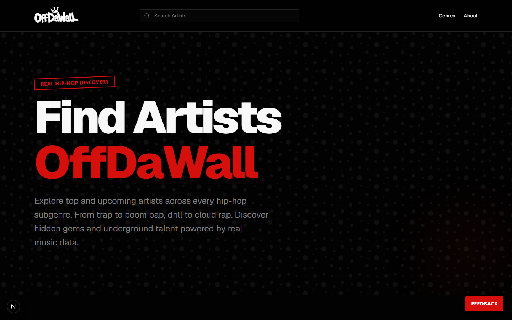
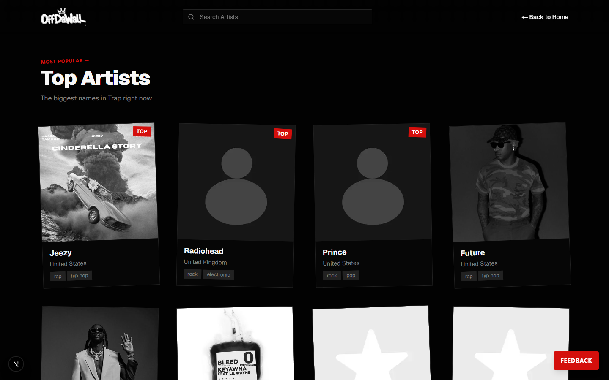
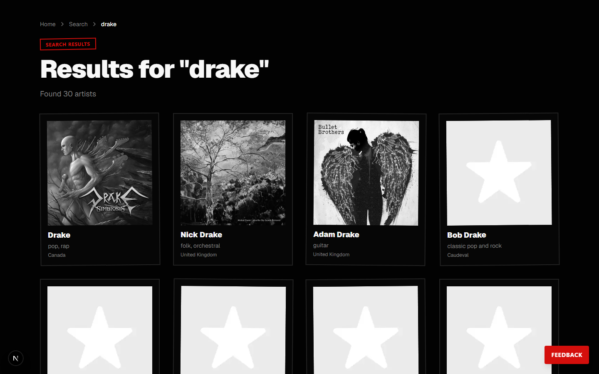

# OffDaWall

> Real hip-hop discovery, powered by real music data.

OffDaWall is a server-first Next.js app for finding hip-hop artists across every subgenre — trap, drill, boom bap, cloud rap, West Coast, Southern hip hop, and more. It aggregates artist metadata and cover art from multiple providers (MusicBrainz, Spotify, Deezer, Last.fm, TheAudioDB, Cover Art Archive) into a single, fast, consistent browsing experience.

## Screenshots

**Home** — search and genre-driven discovery


**Genre page** — top artists for a given subgenre (Trap shown)


**Search results** — aggregated artist search


**Features**
- **Genre-first discovery**: Browse curated subgenres (Trap, Drill, Boom Bap, Cloud Rap, West Coast, Southern Hip Hop, and more) to surface top and underground artists.
- **Unified metadata**: Aggregates data from multiple providers and presents a consistent artist model.
- **Image proxying & caching**: Resolves and caches artist images for consistent display.
- **Small internal APIs**: Route handlers under `app/api/` provide focused endpoints for the frontend.
- **Accessibility & theming**: UI built with Tailwind CSS, Radix primitives, and theme support.

**Tech stack**
- Next.js 16 (App Router)
- React 19 + TypeScript
- Tailwind CSS + Radix UI components
- Provider adapters and server helpers in `lib/server`

**Quick start**

Prerequisites:
- Node.js >= 20 and < 25
- pnpm (recommended; the repo includes `pnpm-lock.yaml`)

Install dependencies and run locally:

```bash
pnpm install
pnpm run check:node   # verifies Node version
pnpm run check:env    # verifies required environment variables
pnpm run dev
```

Build and run for production:

```bash
pnpm run build
pnpm run start
```

**Useful scripts** (see [package.json](package.json))
- **dev**: run Next.js in development
- **build**: build for production
- **start**: start the production server
- **lint**: run ESLint
- **typecheck**: run TypeScript compiler checks
- **smoke:api**: quick API smoke test (see `scripts/smoke-api.mjs`)
- **verify:release**: runs checks and builds for release

**Project layout (high level)**
- [app/](app): Next.js App Router — pages, route handlers, and API routes (look under `app/api`)
  - [app/genres/[slug]/](app/genres): genre landing pages (e.g. `/genres/trap`)
  - [app/artists/[mbid]/](app/artists): artist detail pages
  - [app/search/](app/search): search results page
- [components/](components): UI components and reusable hooks
- [lib/](lib): utilities, clients, and server/provider implementations
  - [lib/server/services/](lib/server/services): provider adapters (MusicBrainz, Spotify, Deezer, Last.fm, etc.)
- [public/](public): static assets
- [scripts/](scripts): helper scripts (`check-node.mjs`, `check-env.mjs`, `smoke-api.mjs`)

**Provider integrations**
Implementations and adapters live under `lib/server/services`. The codebase integrates with multiple music metadata and media providers — inspect each adapter for credential and rate-limit requirements.

**Environment & secrets**
This project uses environment variables for provider keys and runtime configuration. To list required variables run:

```bash
pnpm run check:env
```

See `scripts/check-env.mjs` for the exact checks and `scripts/check-node.mjs` for Node version enforcement.

**Development notes**
- Follow TypeScript and ESLint checks before commits: `pnpm run typecheck` and `pnpm run lint`.
- UI components are in `components/` and primitives under `components/ui`.
- Server-side logic and provider clients are under `lib/server` and `lib/client`.

**Testing & validation**
- There is no formal test harness included; use the smoke script to validate core API paths: `pnpm run smoke:api`.
- Run `pnpm run typecheck` for static type validation.

**Deployment**
The project includes a `vercel.json` and is pre-configured for deployment to Vercel (recommended). Any Next.js-compatible hosting that supports Node >=20 should work.

**Contributing**
- Open issues or PRs against `main`.
- Run `pnpm run lint` and `pnpm run typecheck` locally before submitting PRs.
- Keep provider credentials out of the repo — use environment variables or your platform's secret store.

**License & ownership**
This repository is under a proprietary license owned by `forklift22`. See [LICENSE](LICENSE) for details.

---

For implementation details, inspect [package.json](package.json), `scripts/check-env.mjs`, and the `lib/server/services` adapters.
